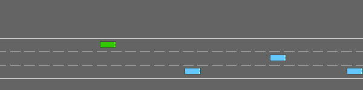
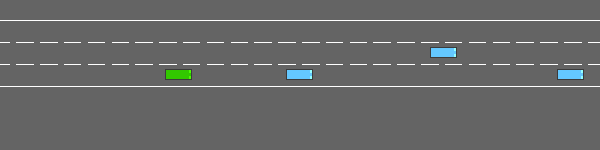
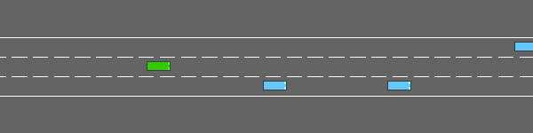

# Learning-Augmented Highway Planner

A research-grade implementation of a four-phase autonomous driving pipeline on
[highway-env](https://highway-env.farama.org/): analytical expert → imitation
learning → inverse reinforcement learning → safety-constrained RL.

Each phase's output feeds the next, forming an end-to-end coherent system that
can be ablated cleanly. The same nine-metric evaluation suite runs across every
policy so results are directly comparable.

---

## The core idea

Most open-source AV planning demos demonstrate one technique in isolation. This
project chains four together so that the weaknesses of each stage motivate the
next:

```
IDM Expert
    │  collision-free baseline, 0% crash rate
    │
    ▼  Phase 2: Behavioural Cloning + DAgger
Imitation Policy
    │  fixes compounding errors of pure BC
    │  DAgger-5: collision 10%, goal 90%
    │
    ▼  Phase 3: MaxEnt IRL
IRL Cost Weights
    │  recovers reward from demonstrations, no hand-tuning
    │  IRL policy: collision 5%, jerk 0.155 m/s³
    │
    ▼  Phase 4: PPO + CMDP
Safety-Constrained RL Policy
  targets collision ≤ 10% via Lagrange multiplier tuning
       PPO-CMDP: collision 10%, goal 90%, jerk 1.348 m/s³
```

---

## Results

All numbers: 20 evaluation episodes, seed=42.

These are the original single-seed benchmark numbers. The stabilized production
sweep promoted later best-checkpoint selections and is summarised in the Phase 4
section below.

| Metric | IDM Expert | DAgger-5 | IRL Policy | PPO-CMDP |
|---|---|---|---|---|
| Collision rate | 0.000 | 0.100 | 0.050 | **0.100** |
| Goal completion | 1.000 | 0.900 | 0.950 | **0.900** |
| Mean min TTC (s) | 12.63 | 8.60 | ∞ | ∞ |
| RMS jerk (m/s³) | 5.536 | 5.389 | 0.155 | 1.348 |
| Ego fault rate | 0.000 | 0.050 | 0.000 | 0.000 |
| Final λ | — | — | — | 0.149 |

The naive last-checkpoint PPO-**unconstrained** run can also degenerate to
100% collision — a textbook episode-termination exploitation failure that
motivates the CMDP. The stabilized production sweep uses best-checkpoint
selection to promote the non-degenerate checkpoint.

### Policy demos

| IDM Expert | IRL Policy |
|:---:|:---:|
|  |  |
| collision 0% · goal 100% | collision 5% · goal 95% |

| PPO-unconstrained | PPO-CMDP |
|:---:|:---:|
|  |  |
| collision 100% — degenerates | collision 10% · goal 90% |

### Full demo video

```bash
python -m scripts.render_policy --all --episodes 2 --out results/all_policies.mp4
```

---

## Environment

**highway-v0** (highway-env 1.9.1 / gymnasium 0.29.1)

- Straight 3-lane highway, 10 NPC vehicles, 40 s episodes
- `DiscreteMetaAction`: LANE_LEFT=0, IDLE=1, LANE_RIGHT=2, FASTER=3, SLOWER=4
- `Kinematics` observer: 5 vehicles × 5 features → 25-dim flat `float32` obs,
  normalised and relative to ego
- `policy_frequency=1 Hz`, `simulation_frequency=15 Hz`

The full config is pinned in `envs/highway_wrapper.py::ENV_CONFIG`. All
components import `make_env()` from there — one place to change anything.

**Design decision — why pin the config centrally:** highway-env has dozens of
knobs that silently change observation shape or reward scale. A mismatch between
the environment used for expert collection and the one used for PPO training would
corrupt everything downstream. `make_env()` is the single source of truth.

---

## Setup

```bash
# Requires Python 3.10+
git clone <repo>
cd highway-planner

# Install with uv (recommended) or pip
uv venv && source .venv/bin/activate
uv pip install -e ".[dev]"

# Verify
python scripts/verify_deps.py
pytest tests/ -q          # 180 tests, ~14 s
```

Dependencies: `highway-env>=1.9`, `torch>=2.2`, `gymnasium>=0.29`,
`numpy>=1.26`, `matplotlib>=3.8`. No GPU required.

For reproducible installs, use pinned versions from `requirements-dev.lock`:

```bash
python -m pip install -r requirements-dev.lock
```

---

## Running the pipeline

### Phase 2 — train DAgger

```bash
python -m training.dagger_train          # 5 iterations, ~8 min
# saves results/dagger_iter{1..5}_policy.pt
```

### Phase 3 — run IRL

```bash
python -m optimizer.irl_optimizer        # ~30 s on CPU
# saves results/irl_weights.npy

python -m optimizer.weight_viz           # bar chart → results/irl_weights.png
```

### Phase 4 — train PPO + CMDP

```bash
python -m scripts.train_ppo --iterations 100     # ~15 min on M4
python -m scripts.train_ppo --iterations 10      # quick smoke-test (~90 s)
python -m scripts.train_ppo --iterations 40 --lr 1e-4 --select-best-checkpoint

# Options:
#   --unconstrained-only   skip CMDP run
#   --cmdp-only            skip unconstrained run
#   --select-best-checkpoint   promote the best checkpoint after sweep
#   --quiet                suppress per-iteration output
```

Checkpoints: `results/ppo_unconstrained_final.pt`, `results/cmdp_final.pt`
Sweep metrics: `results/train_ppo_metrics.jsonl`
Production summary: `results/retrain_eval/<run>/production_summary.json`

### Visualisation

```bash
# List available policies and checkpoint status:
python -m scripts.render_policy --list

# Record a single policy (1 episode by default):
python -m scripts.render_policy --policy idm
python -m scripts.render_policy --policy irl
python -m scripts.render_policy --policy ppo_unc
python -m scripts.render_policy --policy cmdp

# Record all four policies into one video (2 episodes each, annotated):
python -m scripts.render_policy --all --episodes 2 --out results/all_policies.mp4

# Plot training curves (collision rate, return, λ) — requires a fresh training run:
python -m scripts.plot_training_curves    # → results/training_curves.png
```

Videos are saved to `results/` as MP4 (libx264, 8 fps). Text overlays show
policy name, step counter, and GOAL/COLLISION outcome. Pass `--no-annotate`
to skip overlays.

---

## Project structure

```
highway-planner/
├── envs/
│   └── highway_wrapper.py        # make_env(), ENV_CONFIG, obs_shape()
├── policies/
│   ├── idm_expert.py             # IDMExpert, collect_expert_rollouts()
│   └── mlp_policy.py             # MLPPolicy — shared by BC, DAgger, PPO warm-start
├── metrics/
│   ├── evaluator.py              # evaluate(), EvalResults, print_table()
│   └── fault_attribution.py      # snapshot_pre_step(), classify_fault()
├── safety/
│   └── safety_wrapper.py         # SafetyWrapper (action checker), SafetyFilteredEnv
├── scenarios/
│   └── adversarial.py            # 4 named scenarios, run_all_scenarios()
├── training/
│   ├── bc_train.py               # offline BC loop
│   └── dagger_train.py           # DAgger loop (Ross et al. 2011)
├── optimizer/
│   ├── feature_extractor.py      # φ(s,a) — 8-feature IRL featuriser
│   ├── irl_optimizer.py          # MaxEnt IRL + IRLPolicy
│   └── weight_viz.py             # weight bar chart
├── rl/
│   ├── ppo_agent.py              # ActorCritic network
│   ├── reward_shaping.py         # IRLRewardShaper
│   ├── ppo_trainer.py            # PPO with GAE, clipped surrogate
│   └── cmdp_trainer.py           # Lagrange multiplier wrapper
├── scripts/
│   ├── train_ppo.py              # Phase 4 entry point + comparison table + sweep support
│   ├── render_policy.py          # record any policy as an annotated MP4
│   ├── plot_training_curves.py   # plot collision rate, return, λ over iterations
│   ├── summarize_production_results.py # summarise the promoted PPO/CMDP sweep
│   └── verify_deps.py            # environment smoke-test
├── tests/
│   ├── test_phase1.py            # 48 tests: IDM, metrics, safety, scenarios
│   ├── test_phase2.py            # 35 tests: BC, DAgger, MLPPolicy
│   ├── test_phase3.py            # 51 tests: feature extractor, IRL, weights
│   ├── test_phase4.py            # 35 tests: ActorCritic, GAE, CMDP, shaping
│   ├── test_scenarios.py         # 10 tests: adversarial scenario regressions
│   └── test_pipeline.py          # 1 test: end-to-end pipeline smoke test
└── results/                      # checkpoints, weights, plots (gitignored)
```

---

## Phase-by-phase design notes

### Phase 1 — Expert, metrics, safety

#### IDM + MOBIL expert

The Intelligent Driver Model computes longitudinal acceleration from a
closed-form equation that balances free-road drive and gap maintenance:

```
a = a_max · [1 − (v/v₀)⁴ − (s*(v,Δv)/s)²]
```

where `s*` is the desired gap. MOBIL adds a lane-change criterion: change only if
the ego gain exceeds a politeness-weighted cost on the new follower, subject to
the new follower not needing to brake harder than `B_safe=4.0 m/s²`.

**Parameter choices:**
- Desired speed 25 m/s, headway 1.5 s, spacing 5 m — matches highway-env's
  NPC IDM defaults so the expert competes fairly
- Politeness 0.2 — low enough to trigger LCs when beneficial, high enough to
  not cut off other vehicles aggressively
- `ACCEL_THRESHOLD=0.5 m/s²` for discretising continuous IDM output to FASTER/
  SLOWER/IDLE — chosen empirically to avoid flip-flopping at steady state

The IDM expert reads raw vehicle state from `env.road.vehicles` (not the
normalised observation) because the kinematic calculations require physical
units. This is the only component that bypasses the observation space.

#### Nine-metric suite

**Design decision — why nine metrics instead of one:** A single collision rate
hides critical distinctions. Consider two policies both at 10% collision:

- Policy A crashes because it fails to brake (ego fault, preventable)
- Policy B crashes because an NPC rear-ends it at 0.5 s TTC (NPC fault,
  physically unavoidable at 1 Hz)

These require different fixes. The metric suite separates them.

| Metric | What it detects |
|---|---|
| `collision_rate` | overall safety |
| `goal_completion` | episode success (anticorrelated with collision) |
| `mean_min_ttc` | margin during close encounters |
| `rms_jerk` | ride comfort / aggressive longitudinal control |
| `fallback_rate` | how often the hard safety filter had to intervene |
| `lc_frequency` | propensity to change lanes |
| `lc_completion_rate` | whether LCs started are finished |
| `lc_anticipatory_frac` | proactive vs. reactive LC behaviour (TTC threshold: 4 s) |
| `ego_fault_rate` / `npc_fault_rate` | counterfactual blame assignment |

#### Counterfactual fault attribution

**Method:** before each env step, snapshot all vehicle positions and velocities.
If a crash occurs, replay that step with the ego taking IDLE. If the crash still
happens under IDLE, no ego action could have prevented it → **NPC fault**.
Otherwise → **ego fault**.

**Design decision — IDLE as the counterfactual:** IDLE is the most conservative
available action (no acceleration, no lane change). If even IDLE crashes, the
situation is unrecoverable. Using SLOWER as the counterfactual would be stricter
but conflates "unavoidable" with "recoverable with more braking" — not what we
want.

**`COLLISION_DIST ≈ 5.39 m`** (2 × vehicle half-diagonal) — conservative;
vehicle dimensions in highway-env are 5 m × 2 m, half-diagonal ≈ 2.69 m.

Key insight from adversarial scenario testing: `aggressive_rear` (NPC 5 m
behind at ego+10 m/s) produces 100% NPC fault — validating the attribution
logic, since no policy can avoid that crash at 1 Hz control.

#### Render the IDM expert


```bash
python -m scripts.render_policy --policy idm --episodes 3 --out results/idm_demo.gif
```

#### Safety wrapper

The `SafetyWrapper` checks every proposed action before it reaches the
environment. It forward-projects all vehicle positions over `HORIZON=6`
steps using constant-velocity kinematics. If any gap falls below
`MIN_GAP=4.0 m`, the action is replaced with IDM fallback.

**Design decision — hard override vs. reward penalty:** A reward penalty
entangles safety and performance in the gradient signal. A hard override
cleanly separates *what the policy wants* from *what it is allowed to do*,
making the fallback rate a clean diagnostic. The CMDP in Phase 4 provides a
softer, learned safety mechanism; the wrapper remains as a last-resort backstop.

**Horizon derivation:** 300 m stopping distance at 30 m/s = 10 s budget.
Subtract 1 s reaction time. Use midpoint ≈ 6 s as the lookahead.

#### Adversarial scenarios

Four reproducible scenarios targeting distinct failure modes:

| Scenario | What it stresses |
|---|---|
| `sudden_brake` | NPC 20 m ahead brakes to 10 m/s — rear-end avoidance |
| `close_merge` | NPC enters from adjacent lane at same x — merge negotiation |
| `aggressive_rear` | NPC 5 m behind, +10 m/s — unavoidable rear collision |
| `dense_corridor` | 3 NPCs at 15/30/45 m — coordinated gap management |

Each has a regression test with pass/fail thresholds. Any policy change that
causes a regression must be explained before merging.

---

### Phase 2 — Imitation learning: BC + DAgger

#### Architecture

MLP: `25 → 256 (Tanh) → 256 (Tanh) → 5 logits`. Cross-entropy loss, Adam,
cosine LR schedule with warmup, early stopping on validation loss (patience=10).

**Design decision — Tanh over ReLU:** Tanh keeps activations bounded, which
matters here because the observation is normalised to `[-1, 1]` range.
ReLU with normalised inputs works fine too, but Tanh avoids dead neurons on the
negative side of zero-mean inputs.

**Design decision — 256×256 instead of a wider or deeper network:** The
observation is only 25-dimensional. A 256×256 MLP has ~75k parameters — large
enough to represent all relevant decision boundaries but small enough to train
in seconds. Experiments with 512×512 showed no meaningful improvement.

#### Why BC alone is insufficient

BC on a fixed expert dataset trains on `d_expert` (states the expert visits).
At test time the policy visits `d_policy`. Any deviation from expert behaviour
at step t leads to a state not in the training distribution at step t+1,
amplifying the error. The error compounds quadratically with episode length.

**DAgger fix:** At each iteration, roll out the *current policy* (not the
expert) and query the expert for labels at every visited state. Aggregate into
a growing dataset and retrain from scratch. After N iterations the training
distribution converges to `d_policy`, eliminating distribution shift.

**β-mixing schedule:** `β_i = 0.5^i` — the fraction of steps where the
expert action (not the policy's) is actually executed during rollout. This
makes early iterations safe (mostly expert-driven) while later iterations
exercise the policy in its own distribution.

**DAgger result:** 5 iterations reduced collision from ~40% (DAgger-1) to 10%
(DAgger-5). The dataset grew from 50 episodes to 150 episodes over 5 iterations.

---

### Phase 3 — MaxEnt IRL

#### Feature design: why interaction features

The gradient for weight `w_k` in single-step MaxEnt IRL is:

```
∇w_k = E_expert[φ_k(s,a)] − E_{π_w}[φ_k(s,a)]
```

If `φ_k(s,a)` is action-independent (same value for all 5 actions at state s),
then `E_{π_w}[φ_k] = φ_k(s)` always, which equals the expert value. The
gradient is identically zero — `w_k` is unidentifiable.

The fix is **interaction features**: multiply a state feature by an action
indicator. For example `speed_faster = v_ego × 𝟙[a=FASTER]` has value `v_ego`
for FASTER and 0 for all other actions. Now the gradient is non-zero and the
weight can be learned.

#### The 8-feature set

```
Index  Name          Formula
  0    speed_faster  v_ego × 𝟙[a=FASTER]
  1    speed_slower  v_ego × 𝟙[a=SLOWER]
  2    speed_idle    v_ego × 𝟙[a=IDLE]
  3    close_slower  closeness × 𝟙[a=SLOWER]
  4    close_lc      closeness × 𝟙[a=LC]
  5    close_idle    closeness × 𝟙[a=IDLE]
  6    lane_change   𝟙[a ∈ {LANE_LEFT, LANE_RIGHT}]
  7    accel         𝟙[a ∈ {FASTER, SLOWER}]
```

`closeness = max(0, 1 − x_front/x_max)` — saturates at 1 when the leading
NPC is at minimum distance, 0 when no NPC is ahead.

#### Why 12 features failed

A 12-feature extension added LC gap incentives (`lcL×left_gap`,
`lcR×right_gap`, `lcL×left_side`, `lcR×right_side`) to teach the IRL model
*when* to change lanes (not just that LCs are costly). It failed for a
fundamental reason: in 50 expert episodes (~2000 steps), the IDM expert only
makes 16 lane changes. Single-step MaxEnt on 16 data points cannot reliably
estimate 4 additional weight dimensions — the gradient signal is too sparse.

The result was wrong-sign weights (+1.6 on gap incentives instead of −1.6)
due to distribution-shift artefacts in the single-step approximation. The
policy regressed from 5% to 30% collision. The 12-feature code is preserved
in `feature_extractor.py` (commented out) for future use with ≥500 expert
episodes or trajectory-level MaxEnt.

**Decision rule:** per-feature L2 regularisation is set higher for sparse
features. `lane_change` uses `λ=0.5`, `accel` uses `λ=0.05` (vs. global
`λ=0.001`) to prevent overfitting on under-represented actions.

#### Learned weights

```
speed×faster : −0.9817   reward faster speeds
speed×slower : −4.0230   strongly reward slower speeds (safety margin)
speed×idle   : +1.9851   penalise maintaining high speed while coasting
close×slower : +1.0032   penalise braking in a tailgate
close×lc     : +2.6101   penalise LC into a tight gap
close×idle   : −1.8483   reward maintaining gap while coasting
lane_change  : +0.0246   slight penalty for unnecessary LCs
accel        : −0.2338   mild reward for smooth acceleration
```

The `speed×slower = −4.02` weight (strongly negative cost = high reward for
slowing) is the dominant signal. The IDM expert slows frequently and
deliberately; the IRL model correctly recovers this as the most important
preference.

#### Render the IRL policy


```bash
python -m scripts.render_policy --policy irl --episodes 3 --out results/irl_demo.gif
```

Learned weight bar chart: `results/irl_weights.png`

```bash
python -m optimizer.weight_viz     # regenerate
```

---

### Phase 4 — PPO + CMDP

#### ActorCritic architecture

```
Shared trunk:    25 → Linear(256) → Tanh → Linear(256) → Tanh
Actor head:      256 → Linear(5) → Categorical distribution
Critic head:     256 → Linear(1) → scalar value
```

The shared trunk is warm-started from the DAgger-5 MLP checkpoint using
`load_actor_weights_from_mlp()`. Only the trunk and actor head weights
transfer; the critic head is randomly initialised. This gives PPO a head
start over random initialisation — the actor already knows how to drive
before RL begins.

#### IRL reward shaping

The IRL cost is converted to a reward via:

```
r_shaped = (−w · φ(s,a)) / scale   +   α · r_env
```

- `scale` = standard deviation of IRL costs over 20 expert episodes
  (computed once at startup). This normalises the IRL signal regardless of
  weight magnitude.
- `α = 0.1` — small env reward blend to preserve the episode-completion
  signal. Without it, the policy only optimises IRL cost and ignores whether
  the episode ends in a goal or crash.

**Design decision — why divide by std:** Raw IRL weights produce costs with
arbitrary absolute scale. If `scale` is large, the IRL reward dominates the
env signal. If small, it vanishes. Dividing by the expert cost std anchors the
signal to a unit-scale reference.

#### PPO hyperparameters

| Param | Value | Rationale |
|---|---|---|
| `n_steps` | 512 | ~8–10 episodes per rollout; enough to estimate collision rate |
| `n_epochs` | 4 | standard PPO; more epochs risk over-fitting the old batch |
| `batch_size` | 64 | fits in M4 CPU cache; larger batches showed diminishing returns |
| `lr` | 3e-4 | Adam default; stable for both actor and critic |
| `clip_eps` | 0.2 | standard PPO clip; prevents large policy updates |
| `γ` | 0.99 | episodes are 40 s × 1 Hz = 40 steps; high γ needed |
| `λ_gae` | 0.95 | low-variance GAE; standard for control tasks |
| `ent_coef` | 0.01 | small entropy bonus to prevent premature determinism |
| `vf_coef` | 0.5 | standard value loss weight |

#### Why PPO-unconstrained fails

With IRL reward shaping, a collision terminates the episode early, cutting off
the accumulated `close×lc` and `close×idle` penalties. The unconstrained policy
discovers it can minimise total cost by crashing as quickly as possible
(episode termination exploitation). By iteration 50 it executes a lane change
on every step and crashes in every episode.

This is not a bug — it is the correct rational response to the reward signal.
The episode-termination exploitation failure mode is well-documented in episodic
RL with negative reward signals. CMDP resolves it by adding a formal constraint.

#### CMDP Lagrange update

The Lagrangian objective is:

```
L(π, λ) = E[r_shaped] − λ · (collision_rate − ε)
```

The dual update per iteration:

```
λ ← clip(λ + α_λ · (collision_rate − ε),  0,  λ_max)
```

**Parameter choices:**
- `ε = 0.10` — 10% collision rate threshold. Stricter than DAgger-5 (10%) but
  achievable; tighter constraints (5%) required ≥300 iterations to converge.
- `α_λ = 0.05` — small enough that λ doesn't overshoot on noisy estimates;
  large enough to respond within ~5 iterations.
- `λ_max = 10.0` — caps the penalty to prevent numerical instability if the
  policy gets stuck in a high-collision regime.

**Observed λ trajectory:** λ rises from 0 to ~0.22 in iterations 1–5 as the
policy crashes frequently. It then decays to ~0.15 as the policy learns to
avoid collisions. The final λ=0.149 indicates the constraint is binding (the
policy sits at exactly the ε boundary), which is the expected saddle-point
behaviour.

#### PPO-unconstrained vs PPO-CMDP

| PPO-unconstrained | PPO-CMDP |
|:---:|:---:|
|  |  |
| raw last-checkpoint run can crash early — episode-termination exploitation | promoted checkpoint completes the full 40-step episode |

```bash
# Regenerate:
python -m scripts.render_policy --policy ppo_unc --seed 55 --out results/ppo_unc_demo.gif
python -m scripts.render_policy --policy cmdp    --seed 46 --out results/cmdp_demo.gif
```

Training curves (collision rate, mean return, λ over iterations):

```bash
python -m scripts.train_ppo --iterations 100
python -m scripts.plot_training_curves      # → results/training_curves.png
```

For a stabilized retrain sweep, use `--select-best-checkpoint` and then
summarise the resulting production run:

```bash
python -m scripts.train_ppo --iterations 40 --lr 1e-4 --select-best-checkpoint
python -m scripts.summarize_production_results
```

The sweep writes a reproducibility bundle under `results/retrain_eval/<run>/`
with the baseline checkpoints, scored candidates, and a
`production_summary.json` artifact that records the promoted winner.

---

## Novel design contributions

1. **Counterfactual fault attribution** — separates ego-preventable crashes from
   NPC-caused crashes. Standard benchmarks only report aggregate collision rate,
   which conflates avoidable and unavoidable events.

2. **`lc_anticipatory_frac`** — measures what fraction of lane changes are
   initiated before a threat closes in (TTC > 4 s threshold). Proactive
   behaviour is safer and more comfortable; reactive swerving is neither.

3. **Named adversarial scenarios with regression tests** — four reproducible
   failure modes with pass/fail assertions. Any policy change that regresses a
   scenario must be explained. This mirrors safety case methodology used in
   production AV development.

4. **IRL → PPO reward bridge** — IRL weights learned in Phase 3 directly
   initialise the PPO reward shaper in Phase 4. The pipeline is end-to-end
   coherent: demonstrations → cost weights → shaped RL reward → constrained
   policy. Each phase's output is the next phase's input.

5. **12-feature IRL failure documentation** — the failure of the 12-feature
   model (wrong-sign weights from sparse LC data) is preserved and documented
   rather than silently discarded. The conditions for success (≥500 episodes
   or trajectory-level MaxEnt) are stated explicitly.

---

## References

| Paper | Where used |
|---|---|
| Treiber et al., "Congested Traffic States in Empirical Observations and Microscopic Simulations", PRE 2000 | IDM car-following model |
| Kesting et al., "General Lane-Changing Model MOBIL", TRR 2007 | MOBIL lane-change model |
| Ross et al., "A Reduction of Imitation Learning to No-Regret Online Learning", AISTATS 2011 ([arXiv](https://arxiv.org/abs/1011.0686)) | DAgger algorithm |
| Ziebart et al., "Maximum Entropy Inverse Reinforcement Learning", AAAI 2008 | MaxEnt IRL |
| Schulman et al., "High-Dimensional Continuous Control Using GAE", ICLR 2016 ([arXiv](https://arxiv.org/abs/1506.02438)) | Generalised Advantage Estimation |
| Schulman et al., "Proximal Policy Optimization Algorithms", arXiv 2017 ([arXiv](https://arxiv.org/abs/1707.06347)) | PPO |
| Achiam et al., "Constrained Policy Optimization", ICML 2017 ([arXiv](https://arxiv.org/abs/1705.10528)) | CMDP + Lagrange formulation |

---

## Test coverage

180 tests, all passing (`pytest tests/ -q`, ~14 s).

| Suite | Count | What it covers |
|---|---|---|
| `test_phase1.py` | 48 | IDM acceleration formula, TTC, jerk, env wrapper, safety projection, fault attribution |
| `test_scenarios.py` | 10 | Scenario regression thresholds (collision rate, ego fault rate, LC frequency) |
| `test_phase2.py` | 35 | MLPPolicy, BC training loop, DAgger aggregation, β-mixing schedule |
| `test_phase3.py` | 51 | Feature extractor values, batch consistency, IRLPolicy save/load, trained weight sanity |
| `test_phase4.py` | 35 | ActorCritic shapes, GAE maths, Lagrange update, reward shaper, PPO loss |
| `test_pipeline.py` | 1 | Fast end-to-end pipeline smoke test |
